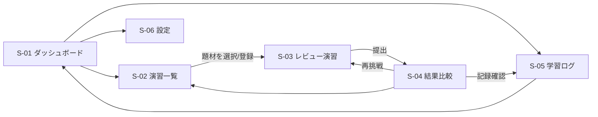
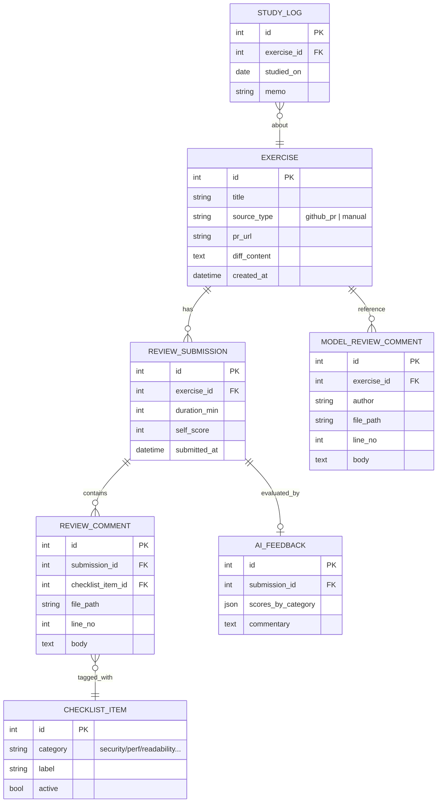

# PRD: コードレビュー・トレーナー(仮称)

| 項目 | 内容 |
|---|---|
| ドキュメント版数 | v1.0 |
| 作成日 | 2026-06-10 |
| プロジェクト種別 | 個人用学習ツール(完全新規) |
| 開発体制 | 1名 / 数ヶ月かけて開発 |

---

## 1. 概要(1行サマリ)

コードレビュー能力を最短で鍛えるための、自分専用トレーニングWebアプリ。

## 2. 背景・課題

- コードレビュー力は「読む量 × 観点の体系化 × 指摘の言語化」で決まるが、意識的に練習する場が存在しない
- OSSの実PRレビューは優れた教材だが、「自分ならどう指摘するか」を先に考えて答え合わせする仕組みがない
- レビュー観点(セキュリティ・性能・可読性・テスト等)のチェックリストを参照しながら練習し、抜け漏れを可視化したい
- 学習の継続(習慣化)を支える記録・ストリーク機能がない

## 3. ユーザー(ペルソナ)

| ペルソナ | 属性 | ペインポイント |
|---|---|---|
| 本人(唯一のユーザー) | Webエンジニア。レビュー力を集中的に強化中 | 練習の場とフィードバックループがない。観点が体系化されていない |

## 4. 成功の定義

- 週3回以上のレビュー演習を継続できている(ストリークで可視化)
- 演習結果の比較で、観点カテゴリ別の「抜け漏れ率」が減少傾向にあること
- 数ヶ月後、実務のPRレビューで指摘の量と深さが向上した実感が得られること

## 5. スコープ外(Won't)

- 複数ユーザー対応・チーム共有機能
- レビュー結果のSNS共有
- 実PRへのコメント自動投稿(学習用途に限定)

## 6. 機能要件(MoSCoW)

### Must(MVP)

| ID | 機能 | 説明 |
|---|---|---|
| F-01 | 演習題材の登録 | GitHubのPR URLを指定して差分を取り込む。またはサンプルコードを手動登録 |
| F-02 | レビュー演習 | 差分を表示し、行を指定して自分のレビューコメントを記入する |
| F-03 | 観点チェックリスト | 演習画面の横に観点リスト(正確性/セキュリティ/性能/可読性/テスト/エラーハンドリング)を常時表示。指摘に観点タグを付与 |
| F-04 | 模範との比較 | 実PRのマージ済みレビューコメント(GitHub APIで取得)と自分の指摘を並べて比較表示 |
| F-05 | 学習ログ | 演習の実施日・所要時間・自己評価を記録。カレンダーとストリーク表示 |

### Should

| ID | 機能 | 説明 |
|---|---|---|
| F-06 | AIフィードバック | Claude API等で自分の指摘の抜け漏れを観点別に採点・講評 |
| F-07 | OSS PRブックマーク | 「読むべきPR」をブックマークし、読了管理する(読む練習の習慣化) |

### Could

| ID | 機能 | 説明 |
|---|---|---|
| F-08 | 弱点分析ダッシュボード | 観点カテゴリ別の抜け漏れ率の推移グラフ |
| F-09 | 復習(間隔反復) | 抜け漏れが多かった演習を一定間隔で再出題 |

## 7. 画面一覧

| # | 画面名 | 概要 |
|---|---|---|
| S-01 | ダッシュボード | ストリーク、直近の演習、弱点サマリ |
| S-02 | 演習一覧 | 登録済み題材の一覧・新規登録 |
| S-03 | レビュー演習 | 差分表示+コメント記入+観点チェックリスト |
| S-04 | 結果比較 | 自分の指摘 vs 模範レビュー/AIフィードバック |
| S-05 | 学習ログ | カレンダー・履歴・ストリーク |
| S-06 | 設定 | GitHubトークン、AI APIキー、観点リスト編集 |

※ PC優先(差分閲覧はワイド画面が前提)。モバイルは閲覧のみ対応。

## 8. 画面遷移図

## 9. データモデル(ER図)

## 10. 非機能要件

| 観点 | 内容 |
|---|---|
| 認証 | なし〜簡易(個人利用。公開URLにする場合はBasic認証等で保護) |
| 性能 | 同時利用1名。差分表示は10,000行程度まで快適に動作 |
| デプロイ | Vercel想定(フロント+API Routes)。DBはSQLite or Supabase |
| 外部連携 | GitHub REST API(PR差分・レビューコメント取得)、AI API(Should以降) |
| 機密度 | 低(公開OSSのコードのみ扱う)。GitHubトークンは環境変数管理 |
| バックアップ | DBの定期エクスポート(手動でも可) |

## 11. リリース計画(目安)

| フェーズ | 内容 | 目安 |
|---|---|---|
| Sprint 1-2 | F-01, F-02, F-03(演習の基本ループ) | 〜1ヶ月 |
| Sprint 3-4 | F-04, F-05(比較と記録 = MVP完成) | 〜2ヶ月 |
| Sprint 5+ | F-06, F-07(AI・読む習慣化)、以降Could | 2ヶ月〜 |
